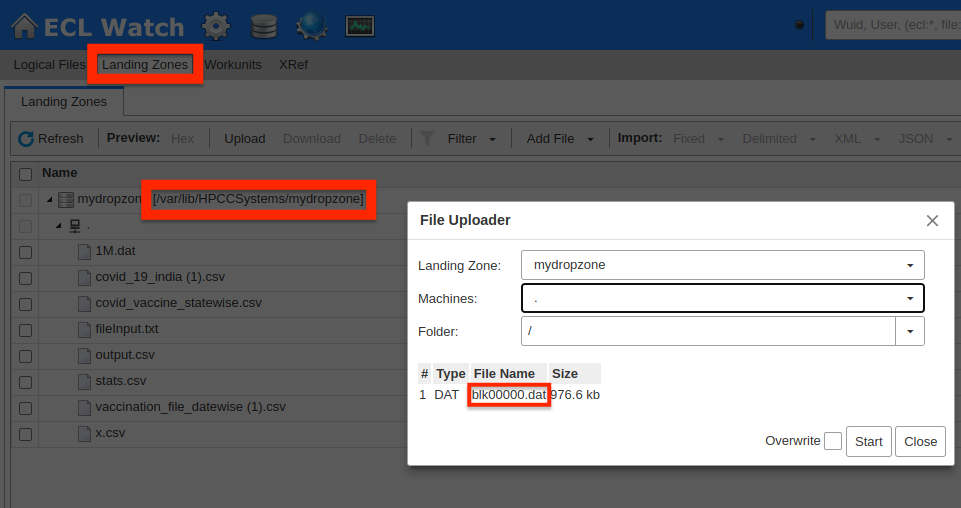
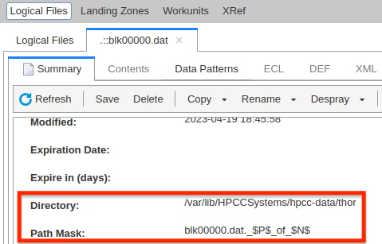
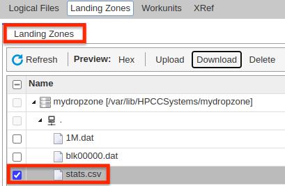

# Bitcoin Blockchain Parser using ECL

This is a Bitcoin Blockchain Parser implemented using C++ and Enterprise Control Language(ECL) for HPCC Systems. It takes a raw blockchain data in the form of blk.dat files as input and processes the headers and transaction data within each block of these files. The Bitcoin parser runs on the distributed and parallelized architecture provided by HPCC Systems leading to higher throughput.

Bitcoin is the biggest and most popular crypto currency having millions of transactions with a block being added every 10 minutes on an average. With the exponential growth of blockchain data over time, having a scalable and robust ECL Bitcoin parser would contribute to swift retrieval of blockchain data with minimum overhead. The proposed implementation provides flexibility as it does not require any external library dependencies and can be run as a single ECL file.

This repo is an adaptation of the excellent work performed by Jeff Chan. The original can be found at [https://github.com/jeffchan/blockchain-parser](https://github.com/jeffchan/blockchain-parser).

## Requirements

1. **HPCC Systems Platform** You need to have a HPCC Systems Platform installed on your systems. The steps for installation and setup can be found [here](https://hpccsystems.com/training/documentation/installation-and-administration/).

2. **ECL IDE** or **VS Code with ECL extension** An IDE linked to the HPCC Cluster has to be setup. This can either be an [ECL IDE](https://hpccsystems.com/training/documentation/ecl-ide-and-client-tools/) or VS Code equipped with [ECL extension](https://marketplace.visualstudio.com/items?itemName=hpcc-systems.ecl). In both cases, the HPCC Systems Client Tools need to be installed and can be found [here](https://hpccsystems.com/training/documentation/ecl-ide-and-client-tools/).

3. **ECL Watch** An interface to the HPCC Systems Platform is needed to be able to spray input files to the parser and obtain the output file in the landing zone. Steps for installation of ECL Watch can be found [here](https://hpccsystems.com/training/documentation/ecl-ide-and-client-tools/).

## Using this Module

1. Clone this repo to your local system and change current directory.
    * ```git clone https://github.com/harsha-hl/Bitcoin-Blockchain-Parser-using-ECL.git```
    * ```cd Bitcoin-Blockchain-Parser-using-ECL/```

2. blk.dat files that are to be sprayed to the cluster can be found at this [link](https://drive.google.com/drive/folders/1jNt7hwmMSdPGMThNLgeguJXcIC-VjhL-?usp=share_link). **Once downloaded, these blk files need to be moved to ```data/``` directory**.
    * Each of these blk.dat files must be named in sequential order starting from blk00000.dat
    * Input addresses can only be parsed provided they are the output addresses of a previously parsed transaction. Hence, the raw data should either **be ordered** or **all the data until a particular timestamp** should be fed as input.

3. The ECL parser can be found at ```parser.ecl``` file and does not have any additional library dependencies to run.

## Steps to Run the Parser

The following steps and examples have been described by taking a local hpcc cluster running on Ubuntu 20.04 machine. The same steps apply for any other scenario with the ECL watch being used in the process. No additional libraries need to be installed as they have been integrated into one single file ```parser.ecl```.

1. Upload the file ```data/blk00000.dat``` into the cluster's landing zone. The path for the dropzone is ```/var/lib/HPCCSystems/mydropzone```.



2. Spray the uploaded ```blk00000.dat``` file as a BLOB type file and give the same name for the logical name of the file. This is because the parser parses the blk files in order starting from ```blk00000.dat , blk00001.dat ....``` and so on.


3. Make sure all the files are sprayed in the same location. In this case, the directory is ```/var/lib/HPCCSystems/hpcc-data/thor```.




**Note : In case of University cluster of HPCC, the directory to which file is sprayed can be just ```/var/lib/HPCCSystems/hpcc-data```. Hence make the required modification in the actual parser file.**

4. ```parser.ecl``` is the file containing the complete parser and doesn't depend on any external libraries. This can be run directly on the cluster by making the following changes.

5. Replace the variable ```dataPath``` in ```parser.ecl``` [[Line 9823](https://github.com/harsha-hl/Bitcoin-Blockchain-Parser-using-ECL/blob/master/parser.ecl#L9823)] with the path to the **folder** containing the above sprayed ```blk00000.dat``` file.


6. Finally replace the path to the output file in ```parser.ecl``` [[Line 9820](https://github.com/harsha-hl/Bitcoin-Blockchain-Parser-using-ECL/blob/master/parser.ecl#L9820)] as required. Having path to the dropzone is essential to be able to download and view the csv file upon running the parser.

7. For example, the path ```/var/lib/HPCCSystems/mydropzone/stats.csv``` caused the ```stats.csv``` file to be generated which has been dowloaded and pushed to this repository.

8. Run the ```parser.ecl``` as a workunit by replacing the above paths [[Line 9820](https://github.com/harsha-hl/Bitcoin-Blockchain-Parser-using-ECL/blob/master/parser.ecl#L9820) and [Line 9823](https://github.com/harsha-hl/Bitcoin-Blockchain-Parser-using-ECL/blob/master/parser.ecl#L9823)] as needed.

9. Refresh the dropzone page on ecl watch to be able to view and download the ```stats.csv``` file.



## Implementation 

Blockchain is divided into multiple blk.dat files with each file having multiple blocks of the blockchain. Every new block added on the blockchain is appended to the latest blk.dat file. The data in the blk.dat file is stored in binary format. The input to the Bitcoin parser is a set of blk.dat files that are sprayed onto the cluter as a BLOB type file.

The files comprising raw blockchain data that is passed to the parser must be having ordered blocks. The parser segregates the hexadecimal data into blocks based on the magic byte present at the start of each block. Various attributes of the block such as version, Previous block hash, merkle root, timestamp, bits and nonce are extracted from the block header data. 

The parser then processes the transaction data which maps the input addresses to the output addresses of previous transactions and creates a connected network of blocks which resembles the blockchain. Other parameters like the value of the transaction, script signature and transaction hash are also calculated. In this fashion, the parser iterates over the entire chain of blocks and writes the parsed contents onto a csv file.

## Output Description

The below table summarizes the information provided in the output file (in csv format). It contains the following :

> COLUMN -> The attributes of a transaction. Ex: Block hash (```Computed_Block_Hash```) of the block this transaction belongs to, the input addresses (```Input_Addresses```) in this transaction etc.

> DESCRIPTION -> This defines the attribute that is being referred to.

> MULTIPLE VALUES -> This denotes whether the attribute is a multivalued field (```Y``` for YES and ```N``` for NO). Ex: ```Input_Addresses``` is a multivalued attribute as more than one input address can participate in a single transaction.

|Column|Description|Multiple Values|
|:-----|:----------|:-------:|
| `Computed_Block_Hash` | This column contains the computed hash of the Bitcoin block, which is calculated based on the data in the block's header and the transactions included in the block. This hash uniquely identifies the block on the Bitcoin network and is used to link blocks together to form the blockchain. | N |
| `Previous_Block_Hash`| This column contains the hash of the previous block in the blockchain. This hash links the current block to the previous block and forms a chain of blocks, hence the term "blockchain" | N |
|`Next_Block_Hash`| This column contains the hash of the next block in the blockchain. This hash is computed by miners as they try to add a new block to the blockchain.|N|
|`Merkle_Root`| This column contains the Merkle root of the transactions included in the block. The Merkle root is a hash of all the transaction hashes in the block, and it serves as a compact summary of all the transactions included in the block.|N|
|`Timestamp`| This column contains the timestamp of when the block was mined. This timestamp is stored as the number of seconds since January 1, 1970, and is used to order blocks chronologically.|N|
|`Nonce`| This column contains the nonce value used by miners to try to find a valid block hash. Miners iterate over nonce values in order to find a block hash that meets the difficulty requirement set by the Bitcoin network.|N|
|`BlockReward`| This column contains the reward that the miner who mined the block received. In the early days of Bitcoin, this reward was 50 bitcoins per block, but it has since been halved multiple times and is currently at 6.25 bitcoins per block.|N|
|`Transaction_Hash`| This column contains the hash of a transaction included in the block. Transactions are included in the block in a specific order, and this hash links the transaction to its place in the block.|N|
|`Input_Addresses`| This column contains the addresses from which the inputs to a transaction were spent. Bitcoin transactions can have multiple inputs, and each input spends the output of a previous transaction.|Y|
|`Transaction_Hash_of_Inputs`| This column contains the hash of the transaction that created the outputs spent by the inputs of a transaction. This hash links the input to the output that it spent.|Y|
|`Input_Amount`| This column contains the amount of bitcoin spent by the inputs of a transaction.|Y|
|`Output_Addresses`| This column contains the addresses to which the outputs of a transaction were sent. Bitcoin transactions can have multiple outputs, and each output sends a certain amount of bitcoin to a specific address.|Y|
|`Output_Amount`| This column contains the amount of bitcoin sent to each output address in a transaction. The sum of the output amounts must be less than or equal to the sum of the input amounts, with the difference being the transaction fee paid to the miner who includes the transaction in a block.|Y|

## Results

* The stats.csv output file contains the parsed information for ```blk00000.dat``` file which contains raw data for about 4500 transactions.


* Considering a particular block (**Block 546** on the bitcoin blockcahin), we now try to map the parsed results with the information stored in [Block 546](https://www.blockchain.com/explorer/blocks/btc/546) on the actual bitcoin blockchain network. We also verify the results in the process by using a trusted bitcoin blockchain information provider such as [Blockchain Explorer](https://www.blockchain.com/explorer).


* We see that there are 4 rows in the stats.csv file having the same ```Computed_Block_Hash``` corresponding to block 546. This indicates that there are 4 transactions that have been recorded on this block. The same is confirmed on Blockchain Explorer.

* The details of the 4 transactions are then verified by focusing mainly on one transaction ([Transaction with txid 2](https://www.blockchain.com/explorer/transactions/btc/6b0f8a73a56c04b519f1883e8aafda643ba61a30bd1439969df21bea5f4e27e2)) which forms the 3rd transaction (0 indexing)recorded on this block.


* The input addresses are ```1KAD5EnzzLtrSo2Da2G4zzD7uZrjk8zRAv``` and ```1DZTzaBHUDM7T3QvUKBz4qXMRpkg8jsfB5``` and the output addresses are identical i.e ```1KAD5EnzzLtrSo2Da2G4zzD7uZrjk8zRAv```. The bitcoin flow in the transaction can also be verified here with a net flow of 25 BTC (1 BTC + 24 BTC).


